# 普源精电 | RIGOL
> 原文链接: https://www.rigol.com/about/about/history

---

产品家族专区

促销活动

公司新闻

博客

[

### RIGOL 超便携家族

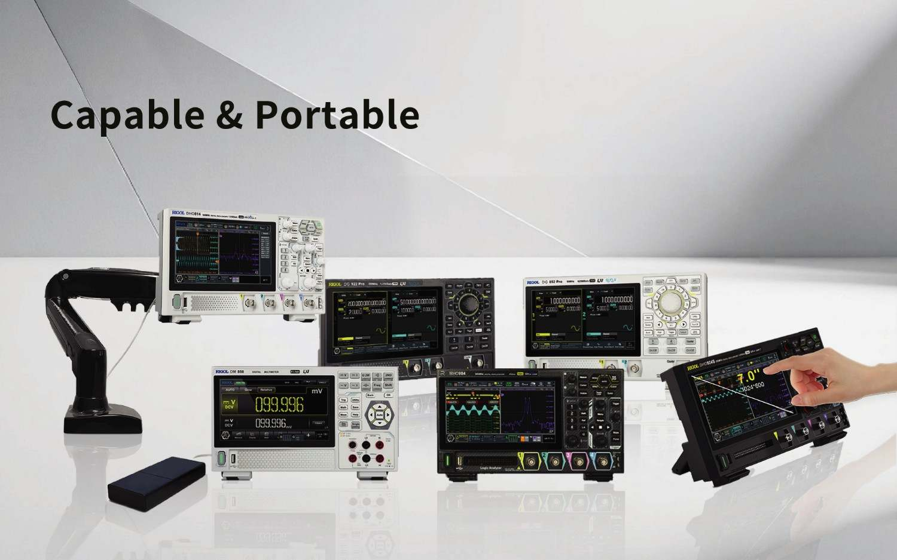

](https://www.rigol.com/zh_CN/campaign/ultra_portable_family.html)

[

### RIGOL 多场景信号方案专区

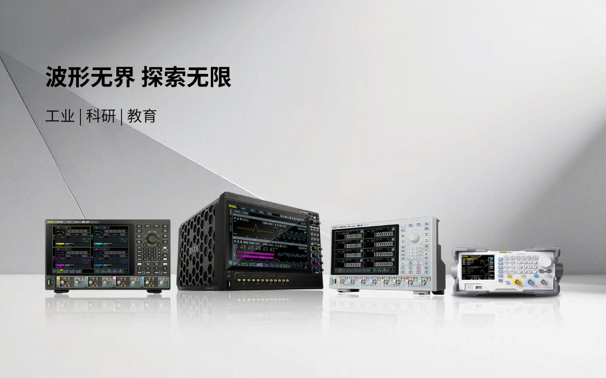

](https://www.rigol.com/zh_CN/campaign/signal_solutions.html)

[

### RIGOL 射频产品家族

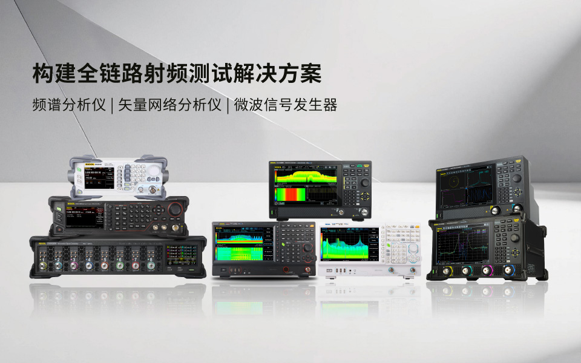

](https://www.rigol.com/zh_CN/campaign/rf_product_family.html)

[

公司大事记

### 寰宇新程，无限可能 | 普源精电（RIGOL）今日正式登陆H股！

2026年7月9日

](https://www.rigol.com/zh_CN/news/company-news/rigol-lists-on-HKEX.html)

[

新品发布

### 大器至简，射频至极 | 普源精电（RIGOL）超便携射频新品登场！

2026年6月30日

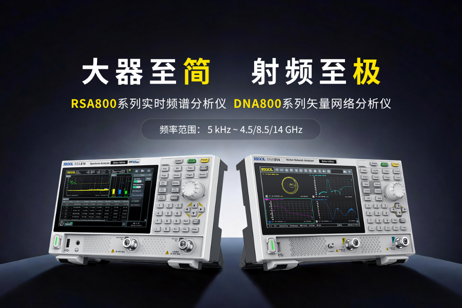

](https://www.rigol.com/zh_CN/news/company-news/DNARSA800-release.html)

[

新品发布

### 让集成更高效 | 普源精电（RIGOL）发布DNA6000-R系列矢量网络分析仪

2026年6月17日

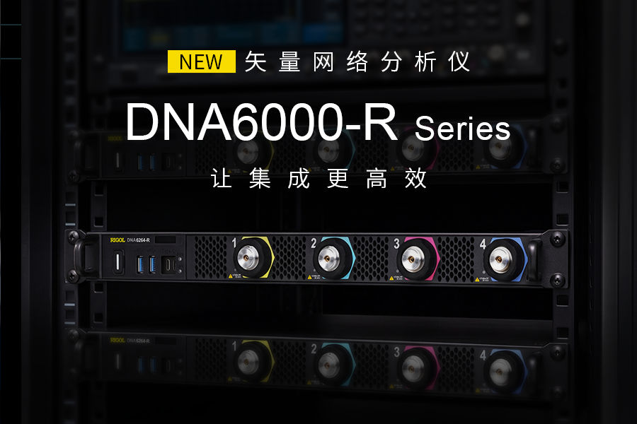

](https://www.rigol.com/zh_CN/news/company-news/DNA6000-R-release.html)

[

新品发布

### 藏锋于薄，大显于精 | 普源精电（RIGOL）发布16GHz带宽高分辨率数字示波器DHO50000系列

2026年4月22日

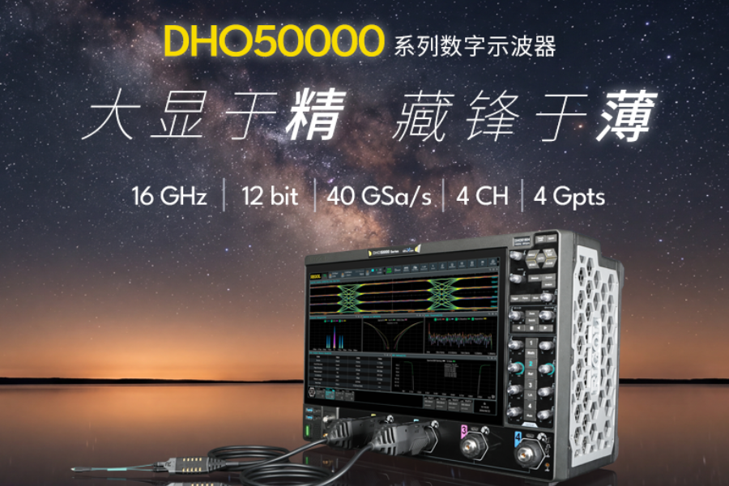

](https://www.rigol.com/zh_CN/news/company-news/DHO50000-release.html)

[

新品发布

### 方寸尽显，6GHz 实力 | RIGOL发布MSO/DS9000系列数字示波器

2026年4月22日

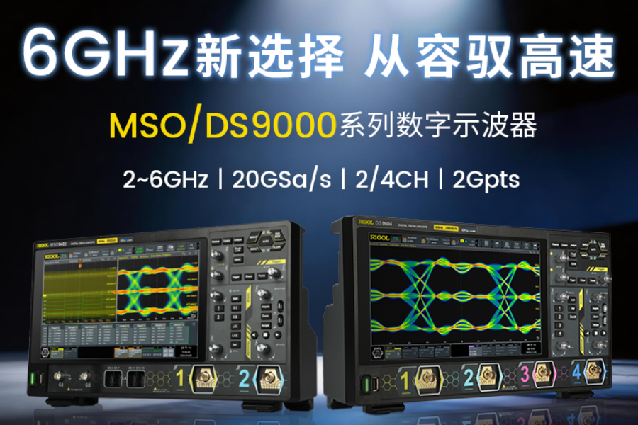

](https://www.rigol.com/zh_CN/news/company-news/MSODS9000-release.html)

[

新品发布

### 小，见大不同 | 普源精电（RIGOL） DS9404 4GHz 示波器破局登场！

2025年12月15日

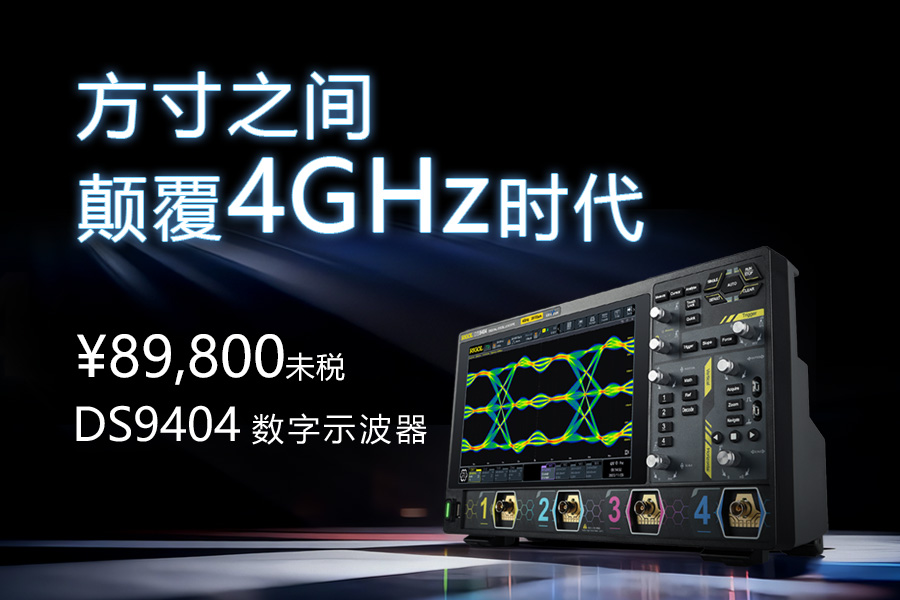

](https://www.rigol.com/zh_CN/news/company-news/ds9404-release.html)

[

新品发布

### 无需功放，直驱未来 | RIGOL DG6000 旗舰级函数/任意波形发生器重磅发布

2025年12月1日

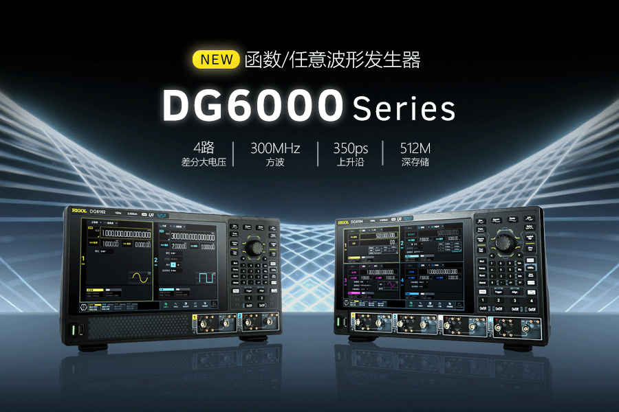

](https://www.rigol.com/zh_CN/news/company-news/dg6000-release.html)

[

新品发布

### 让网分走进每一个工作台——普源精电（RIGOL）全新DNA5000/6000系列矢量网络分析仪正式发布

2025年10月20日

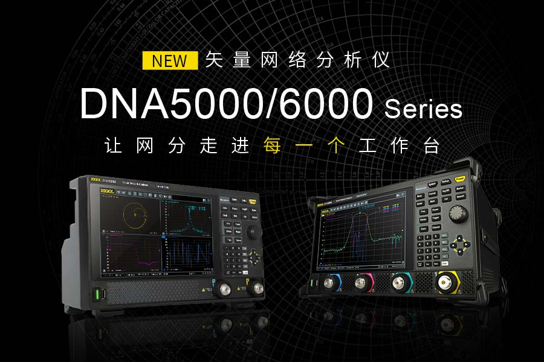

](https://www.rigol.com/zh_CN/news/company-news/DNA5000-6000-release.html)

[

新品发布

### 以极致回馈极客 | 普源精电（RIGOL）MHO900 系列超便携高分辨率示波器震撼发布

2025年9月8日

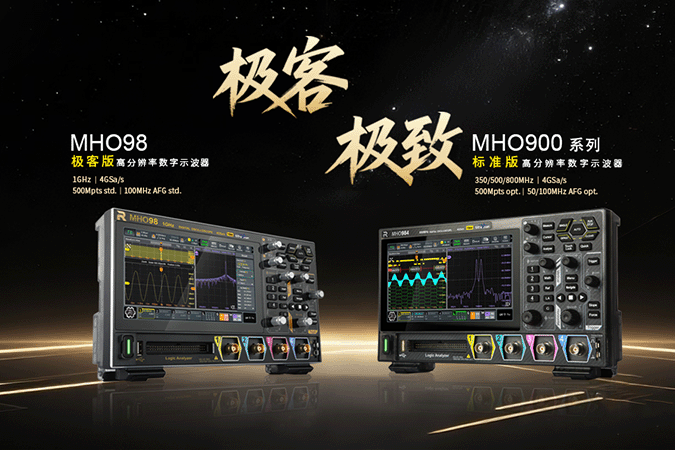

](https://www.rigol.com/zh_CN/news/company-news/mho900-release.html)

[

新品发布

### 普源精电（RIGOL）全新实时频谱分析仪重磅发布！

2025年8月18日

\-

3分钟阅读

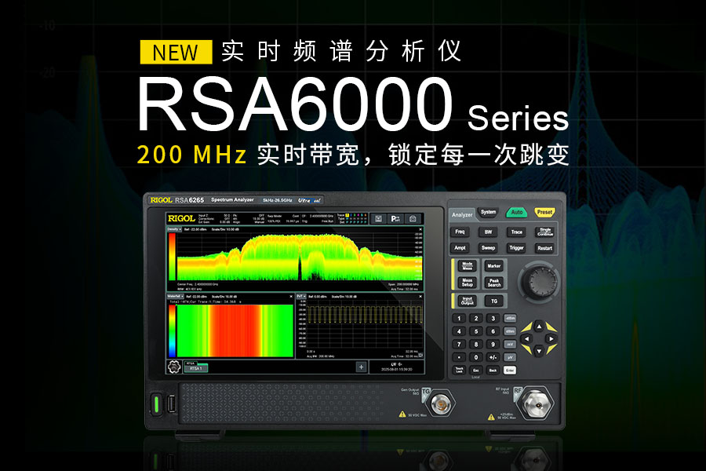

](https://www.rigol.com/zh_CN/news/company-news/rsa6000-release.html)

[

荣誉奖项

### 苏州市唯一！RIGOL入选江苏省高价值专利培育计划

2025年7月8日

](https://www.rigol.com/zh_CN/news/company-news/jiangsu-high-value-patents.html)

[

新品发布

### 为探索者赋能|普源精电（RIGOL）发布多通道波形发生及先进计算解决方案

2025年7月8日

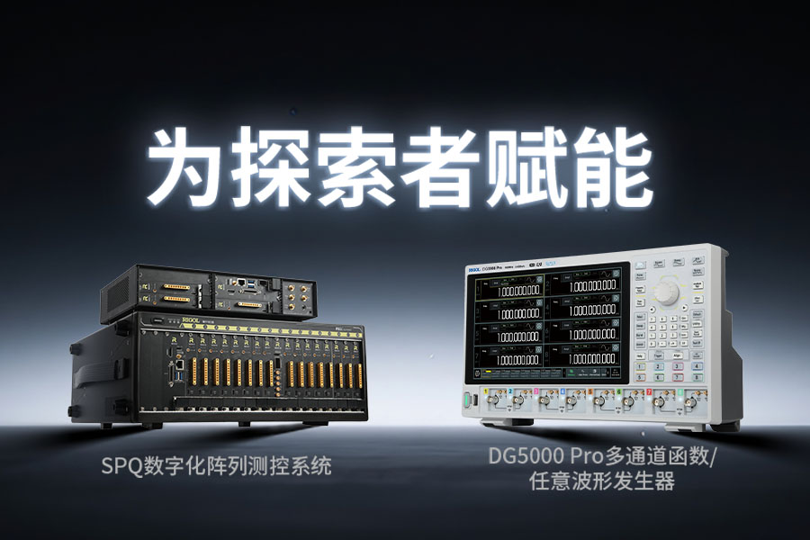

](https://www.rigol.com/zh_CN/news/company-news/dg5000pro-spq-release.html)

[

新品发布

### 多维洞察，触手可及 | 新品！MHO2000系列高分辨率数字示波器惊喜登场

2025年7月8日

](https://www.rigol.com/zh_CN/news/company-news/mho2000-release.html)

[

客户案例

### 矢量网络分析仪助力汽车线缆及天线测试效率提升

2026年6月5日

.png)

](https://www.rigol.com/zh_CN/news/blogs/vna-automotive-cable-and-antenna-testing.html)

[

应用笔记

### 800V HVDC数据中心电源架构下SiC/GaN功率器件动态特性测试

2026年5月27日

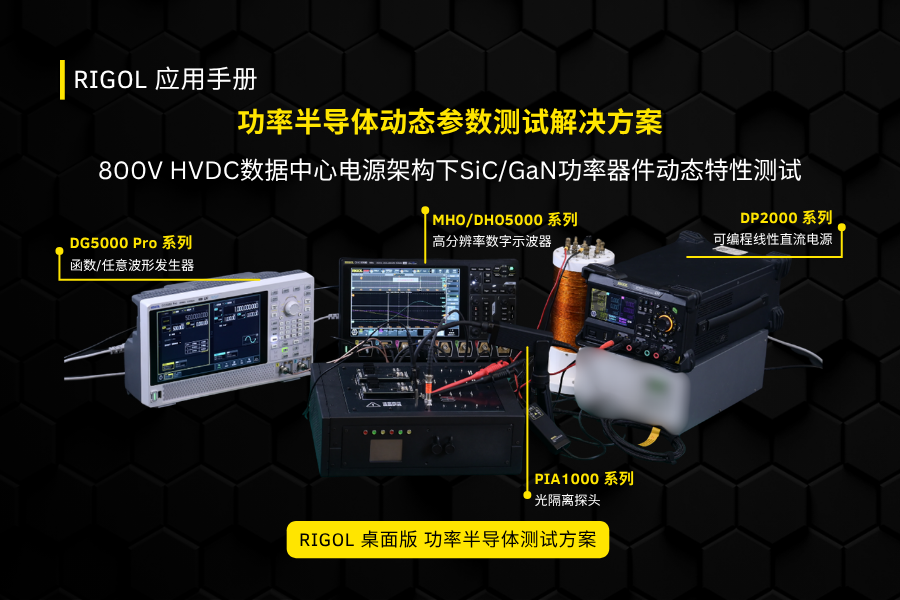

](https://www.rigol.com/zh_CN/news/blogs/800v-hvdc-datacenter-sic-gan-power-device-dynamic-test-news.html)

[

应用笔记

### 矢量网络分析仪在MRI射频子系统研发测试中的应用

2026年2月6日

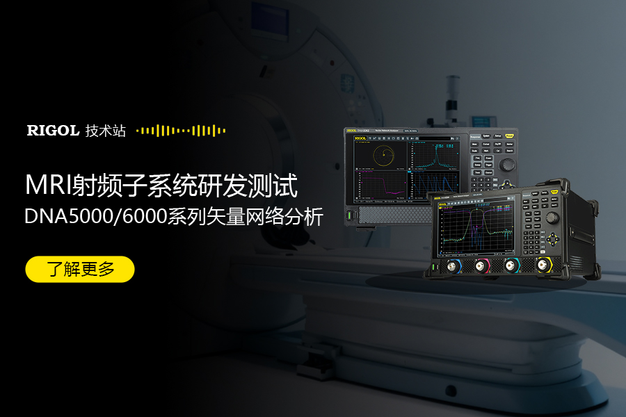

](https://www.rigol.com/zh_CN/news/blogs/mri-rf-subsystem-test.html)

[

应用笔记

### 面向AI数据中心的800G互连：基于示波器的AEC延迟与相位偏移测试方案

2026年2月10日

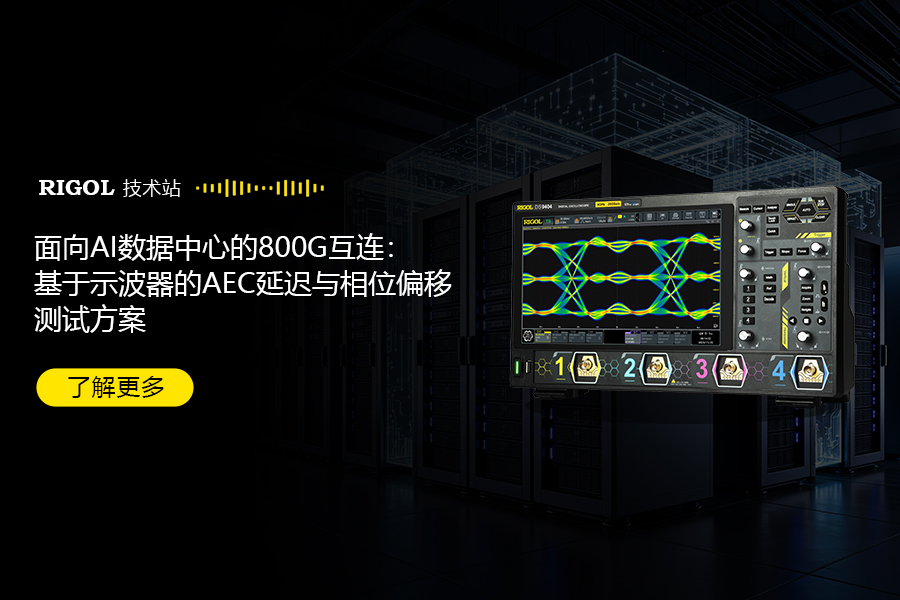

](https://www.rigol.com/zh_CN/news/blogs/aec-latency-phase-offset-testing.html)

[

客户案例

### DG70000系列任意波形发生器 赋能重点实验室高精度激光器线性度测试

2026年1月16日

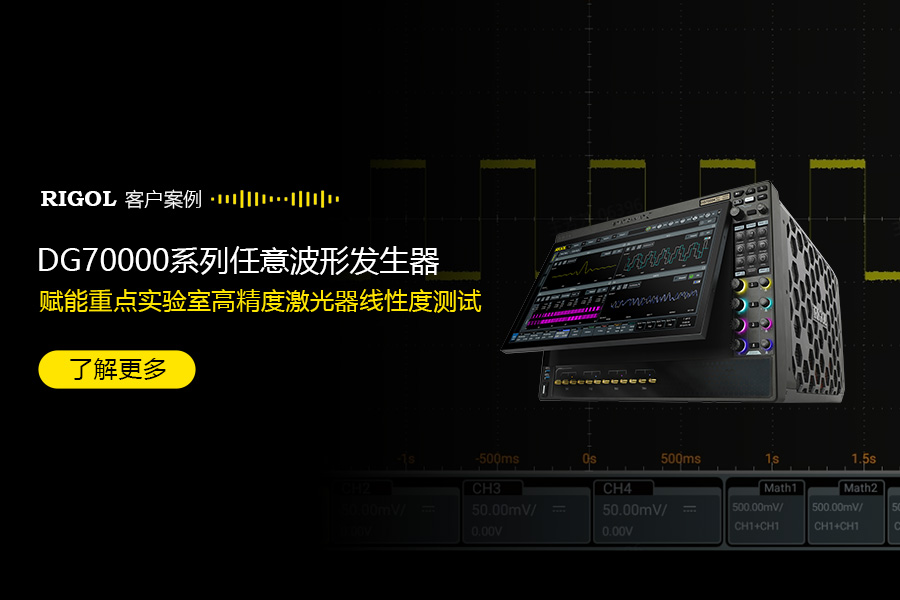

](https://www.rigol.com/zh_CN/news/blogs/DG70000-%E7%B3%BB%E5%88%97%E4%BB%BB%E6%84%8F%E6%B3%A2%E5%BD%A2%E5%8F%91%E7%94%9F%E5%99%A8-%E8%B5%8B%E8%83%BD%E9%87%8D%E7%82%B9%E5%AE%9E%E9%AA%8C%E5%AE%A4%E9%AB%98%E7%B2%BE%E5%BA%A6%E6%BF%80%E5%85%89%E5%99%A8%E7%BA%BF%E6%80%A7%E5%BA%A6%E6%B5%8B%E8%AF%95.html)

[

客户案例

### PRBS-NRZ信号生成

2026年4月8日

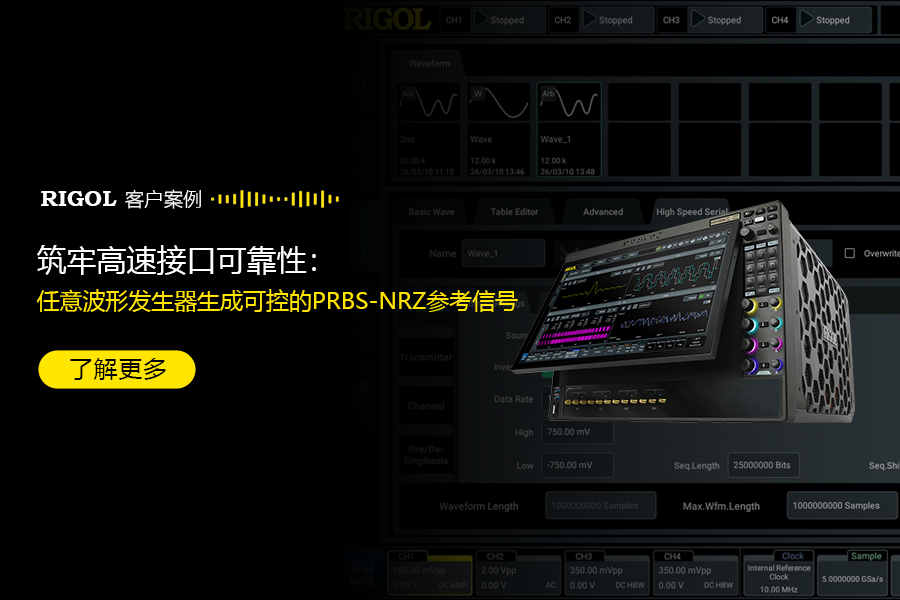

](https://www.rigol.com/zh_CN/news/blogs/DG70000-PRBS-NRZ-Signal-Generation.html)

[

应用笔记

### RIGOL集成化电源测试平台方案

2026年1月12日

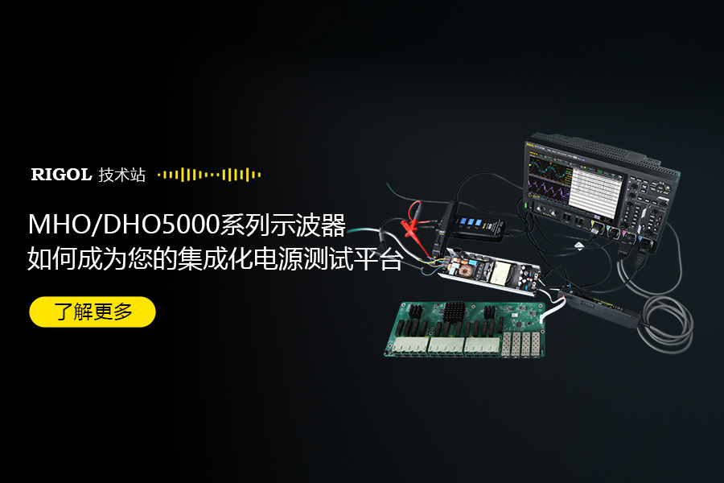

](https://www.rigol.com/zh_CN/news/blogs/power-analysis-function.html)

[

应用笔记

### 矢量网络分析仪在传感器散射参数与谐振点频偏测试中的应用

2026年1月9日

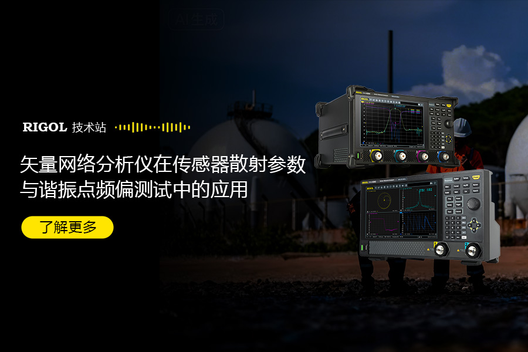

](https://www.rigol.com/zh_CN/news/blogs/vna-saw-test.html)

[

技术站

### 打破带宽壁垒——超宽带实时扫描技术如何重塑宽带频谱分析

2025年10月29日

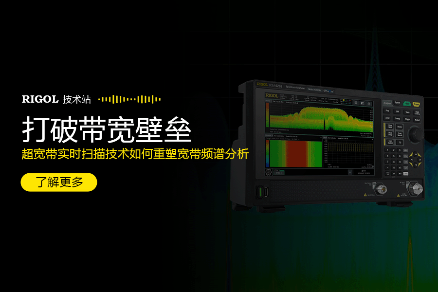

](https://www.rigol.com/zh_CN/news/blogs/real-time-spectrum-scan.html)

[

技术站

### RTSA模式下的PLL分析——实时频谱分析仪如何攻克锁相环(PLL)测量的核心痛点

2025年10月29日

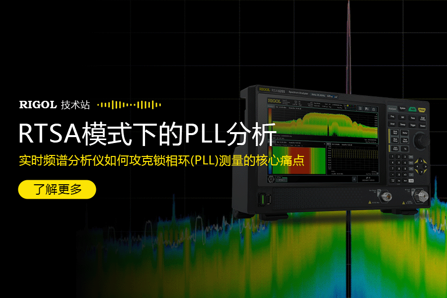

](https://www.rigol.com/zh_CN/news/blogs/RSA6000-PLL-test.html)

[

技术站

### IQ解调芯片相位如何同步

2024年10月8日

](https://www.rigol.com/zh_CN/news/blogs/iq-demodulation-phase-sync.html)

1

1

2

2